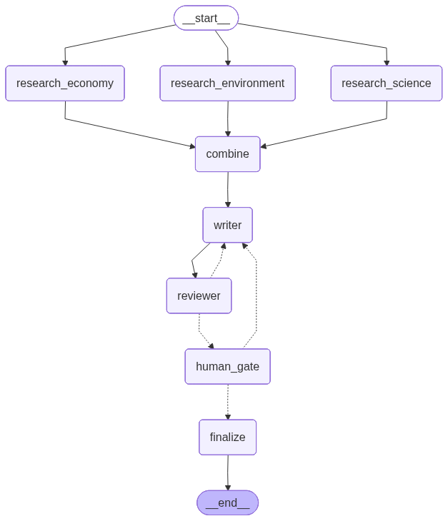

# LangGraph Learning

[](https://github.com/shanto12/LangGraph-Learning/actions/workflows/ci.yml)

A single-file, heavily-commented tour of core [LangGraph](https://langchain-ai.github.io/langgraph/)
concepts, built around a small team of agents that collaborate to write a short
article. Powered by [z.ai](https://z.ai) GLM models through the OpenAI-compatible API.

## The graph



```
START ─┬─> research_environment ─┐
       ├─> research_economy      ├─> combine ─> writer ─> reviewer ─┐
       └─> research_science  ────┘                ^                 │
                                                   └── needs work ──┘
                                                            │ (approved / capped)
                                                            v
                                      human_gate ──approve──> finalize ─> END
                                          ^   │
                                          └───┘ (human sends feedback -> writer)
```

- **Researchers** — three agents each research a different angle, **in parallel**.
- **Combine** — merges their notes into one brief (fan-in).
- **Writer** — drafts the article and revises on feedback.
- **Reviewer** — an AI editor that approves or loops the draft back to the writer.
- **Human gate** — pauses for a person to approve or hand back feedback.
- **Finalize** — publishes the approved draft.

## Concepts demonstrated

| Concept | Where |
|---|---|
| State + reducers (`operator.add` for parallel writes) | `State`, `research_notes` |
| Multi-agent nodes & a node factory | `make_researcher` |
| Parallel fan-out / fan-in | `START -> research_* -> combine` |
| Conditional edges + cycles (with a termination cap) | `route_after_review`, `MAX_REVISIONS` |
| Structured output (Pydantic, function-calling) | `Review`, `reviewer_llm` |
| Streaming (`stream_mode="updates"`) | `stream_until_pause` |
| Human-in-the-loop (`interrupt()` / `Command(resume=...)`) | `human_gate` |
| Durable memory (SQLite checkpointing) | `SqliteSaver`, `checkpoints.sqlite` |
| Graph visualization (Mermaid) | `get_graph().draw_mermaid()` |

## Setup

```bash
pip install -r requirements.txt

# z.ai API key (coding plan). Get one at https://z.ai
export ZAI_API_KEY="your-key-here"
```

## Run

```bash
python3 main.py                      # uses the default topic (bees)
python3 main.py "How do vaccines work?"   # or pass your own topic
```

The script prints the graph as Mermaid, streams each node's progress, and pauses
at the human gate — type `approve` to publish, or type feedback to send the draft
back to the writer.

## Notes

- The model is `glm-5.1` on z.ai's **coding-plan** endpoint
  (`https://api.z.ai/api/coding/paas/v4`). The pay-as-you-go endpoint is
  `.../api/paas/v4`.
- Structured output uses `method="function_calling"` — GLM's default JSON-schema
  mode isn't fully supported.
- `checkpoints.sqlite` is local runtime state (git-ignored); reuse a `thread_id`
  to resume a run across restarts.
